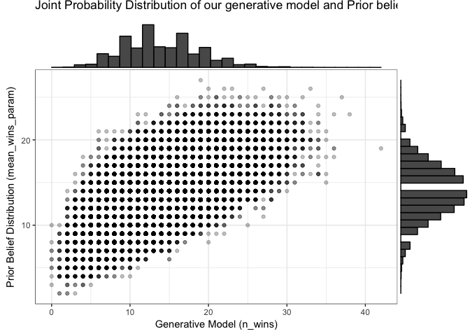
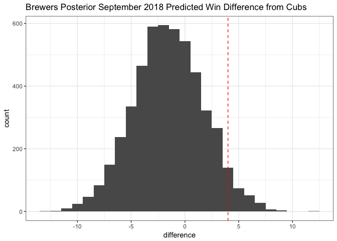

Can the Brewers catch the Cubs in September 2018?
================
Brandon Hoeft
September 9, 2018

-   [Bayes meets Baseball](#bayes-meets-baseball)
-   [Research Question](#research-question)
-   [Define our analytical ingredients](#define-our-analytical-ingredients)
-   [Rejection Sampling Approach](#rejection-sampling-approach)
-   [Conclusion](#conclusion)
-   [Appendix: Analytical Approach](#appendix-analytical-approach)

Bayes meets Baseball
--------------------

It is a Sunday afternoon in September 2018, and my Milwaukee Brewers are chasing the Chicago Cubs for the Division title in 2018. The Cubs are the heavy favorites, and my Brewers tend to make a playoff run only once in a blue moon.

Given that I just finished up a course on the [Foundations of Bayesian Analysis](https://www.datacamp.com/courses/fundamentals-of-bayesian-data-analysis-in-r) by Rasmus Bååth this afternoon, I want to apply some of my new learned knowledge of Bayesian workflow to a question that's going to be on my mind all month: *"What are the chances Milwaukee catches Chicago for the division title!?"*

Research Question
-----------------

Milwaukee entered September 1, 2018 [4 games behind the Chicago Cubs](https://www.baseball-reference.com/boxes/?year=2018&month=8&day=31) in the division standings.

Joe Maddon (Cubs) and Craig Counsell (Brewers) have each had 3 Septembers at the helm of their clubs coming into September 2018.

**Heading into September 2018, what is the probability that the Brewers can make up a 4 game deficit in the standings, based on past September performance for each manager?**

We'll treat this problem as predicting the number of wins for each team in September using [Bayesian analysis](https://en.wikipedia.org/wiki/Bayesian_inference).

Define our analytical ingredients
---------------------------------

To complete this analysis, we need to define a few things:

-   **parameter(s) of interest**: The number of predicted September 2018 Wins for the Cubs and Brewers.

-   **Data**: Win counts for Joe Maddon and Craig Counsell in September, as managers of the Cubs and Brewers, respectively. Each has managed their teams in 2015, 2016, and 2017.
-   **priors**: information about our prior knowledge of September win totals, before incorporating observed data. Priors are a way of describing uncertainty in our data and prevent against overfitting (giving too much weight to data). We'll us a weak, information prior centered around 14 Wins, equivalent to a .500 winning percentage.
-   **a generative model**: a set of rules that can model the ways in which the observed data may have been generated. This is done by plugging in parameter values and simulating draws from that model or ruleset. We'll use a [Poisson Distribution](https://en.wikipedia.org/wiki/Poisson_distribution) to model the mean Wins for each team in September. This model has one parameter, the mean number of events per time period.

From these components, we can build up a Bayesian model for each Joe Maddon's Cubs and Craig Counsell's Brewers, and derive posterior distributions of their September Wins. A [posterior distribution](https://en.wikipedia.org/wiki/Posterior_probability) is a summary probability distribution over our parameter.

The great thing about posterior distributions, is we can use them to derive new information for decision analysis through simulation. In this case, we'll simulate draws from each team's posterior of 2018 predicted wins, and measure what proportion of the time the Brewers get &gt; 4 more September wins than the Cubs. This would represent the probability that the Brewers will win the 2018 Division Title on our small world model of past September performance.

Rejection Sampling Approach
---------------------------

Here we will solve our simple one parameter model by generating a large number of samples from our prior, and use that prior distribution to generate samples from our Poisson process. The results represent a joint probability distribution between the likelihood of the data and prior

``` r
library(dplyr)
library(ggplot2)
# The Data: 2015, 2016, 2017 September Wins
milw_sept_data <- c(13, 14, 15)
cubs_sept_data <- c(19, 17, 19)

# 
n_draws <- 100000
set.seed(123)
# weakly informed prior, mean parameter to describe uncertainty about September Wins
mean_wins_param <- round(rnorm(n_draws, mean = 14, sd = 3)) 
# generative model for September Wins: P(data | theta)
n_wins <- rpois(n_draws, lambda = mean_wins_param) 
# combined, these form a joint probability distribution over draws from the generative
# model using prior beliefs about the data to simulate the draws. 
prior <- data.frame(mean_wins_param, n_wins)

p1 <- ggplot(prior, aes(n_wins, mean_wins_param)) + geom_point(alpha = 0.25) +
    labs(title = "Joint Probability Distribution of our generative model and Prior belief Distribution",
         x = "Generative Model (n_wins)",
         y = "Prior Belief Distribution (mean_wins_param)") +
    theme_bw()

ggExtra::ggMarginal(p1, type = "histogram")
```



To get the posterior distribution, we must condition on the data. For the Cubs and the Brewers, we'll filter the **prior** dataframe on the rows that generated the mean number of September Wins each team observed the past 3 years (the data). This yields us samples from the posterior distribution of each team's September wins. We can derive new metrics, such as the difference in wins between the teams in September.

``` r
# Posterior distributions: condition on the data. P(theta | data)
posterior_milw <- prior[prior$n_wins == round(mean(milw_sept_data)), ]
posterior_cubs <- prior[prior$n_wins == round(mean(cubs_sept_data)), ]

posterior <- data.frame(brewers = posterior_milw$mean_wins_param[1:5000], 
                        cubs = posterior_cubs$mean_wins_param[1:5000])

posterior$difference <- posterior$brewers - posterior$cubs

posterior %>%
    ggplot(aes(x = difference)) + geom_histogram(binwidth = 1) +
    labs(title = "Brewers Posterior September 2018 Predicted Win Difference from Cubs") +
    geom_vline(xintercept = 4, color = "red", linetype = "dashed") +
    theme_bw()
```



Conclusion
----------

We observe that the Milwaukee Brewers have only a 3.28% chance of taking the division from the Cubs this September.

``` r
100 * mean(posterior$difference > 4)
```

    [1] 3.28

Of course, this is an unrealistically simple model that considers only 1 piece of data, the average number of September wins from the Brewers and Cubs the past 3 seasons under Joe Maddon and Craig Counsell, respectively. This very small world representation is too simple to be a reliable estimate.

However, it is a fun simple application of Bayesian inference, combining prior beliefs with a generative model (something that simulates data). By conditioning on the data, we yield a posterior distribution, or summary, of the most likely win totals for the Cubs and Brewers this September 2018. From samples of the posterior distributions for each team, we can derive probability estimates, such as the probability that the Brewers will win 4+ more games than the Cubs this month to win the Division.

Appendix: Analytical Approach
-----------------------------
